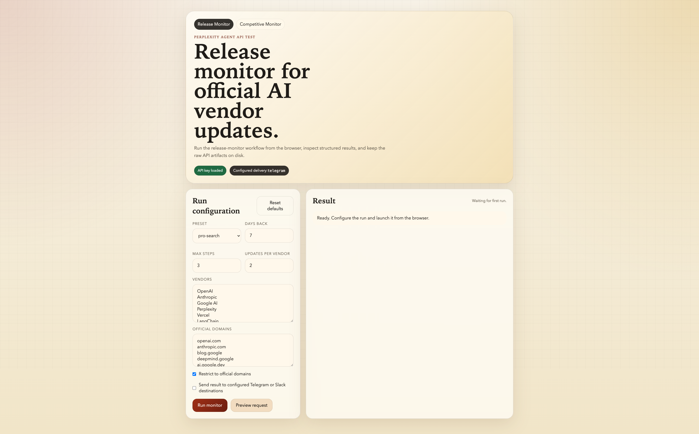
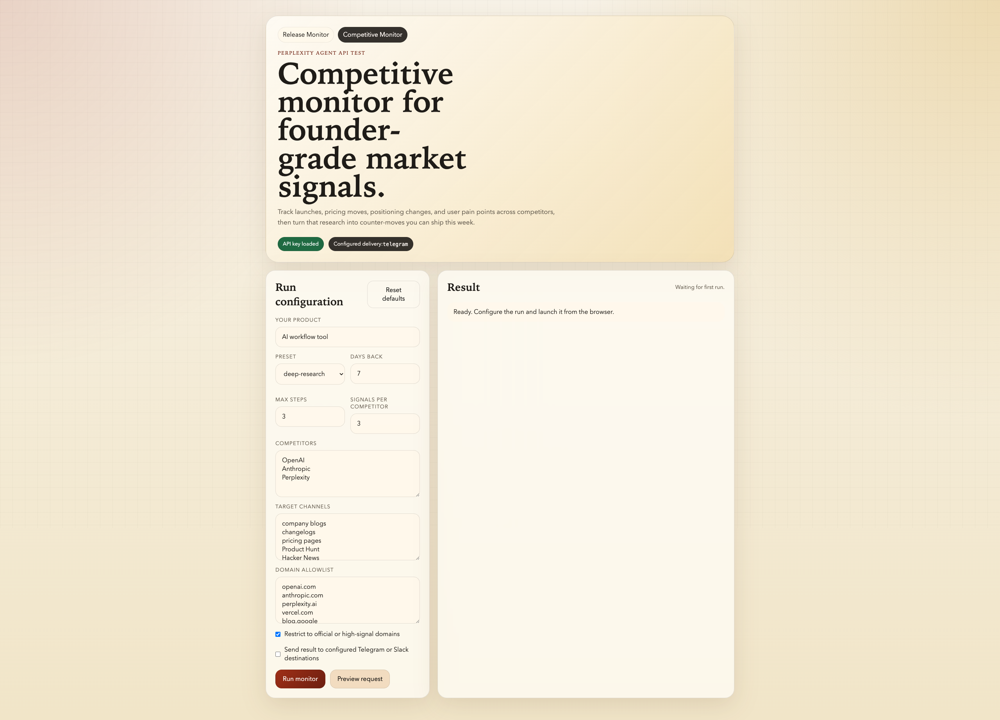
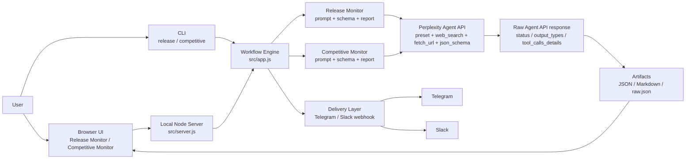

# Perplexity Agent API Demo Suite

Two practical Perplexity Agent API demos live in this repo:

- **Release Monitor**: tracks recent official product and platform updates from major AI vendors
- **Competitive Monitor**: researches competitors and returns founder/GTM-oriented signals, threat levels, and counter-moves

Both demos share the same core approach:

- use Perplexity's **Agent API presets**
- enable built-in **`web_search`** and **`fetch_url`**
- force **JSON Schema structured output**
- enrich the model's `source_titles` back into clickable URLs from the raw API response
- expose **Agent API evidence** in the UI so the run is visibly tool-using rather than just plain text generation

## Screenshots

### Release Monitor



### Competitive Monitor



## Architecture



The official docs used for the request design:

- [Agent API quickstart](https://docs.perplexity.ai/docs/agent-api/quickstart)
- [Tools overview](https://docs.perplexity.ai/docs/agent-api/tools/overview)
- [Output control](https://docs.perplexity.ai/docs/agent-api/output-control)
- [Presets](https://docs.perplexity.ai/docs/agent-api/presets)
- [Prompt guide](https://docs.perplexity.ai/docs/agent-api/prompt-guide)

## Why These Demos Are Agentic

These workflows do more than prompt-and-summarize:

- the model decides which sub-queries to run
- it performs repeated `web_search` calls over the requested entities and time window
- it can escalate to `fetch_url` for deeper page context
- it synthesizes retrieved evidence into schema-constrained output
- the app surfaces `status`, `model`, `output_types`, `response_id`, and `usage.tool_calls_details` so you can inspect the retrieval behavior directly

That means the demo shows an actual tool-using workflow, not just "chat with citations."

## Agent API Feature Map

| Agent API capability | Release Monitor | Competitive Monitor | How this repo uses it |
| --- | --- | --- | --- |
| Presets | `pro-search` by default | `deep-research` by default | Presets control the default model and retrieval profile for each workflow |
| Built-in `web_search` | Yes | Yes | Finds recent official updates, launches, pricing shifts, and competitor signals |
| Built-in `fetch_url` | Yes | Yes | Available for deeper page inspection when snippets are not enough |
| JSON Schema output | Yes | Yes | Forces normalized machine-readable report structures |
| Search domain filters | Yes | Yes | Optional UI checkbox keeps searches on official or high-signal domains |
| Response metadata | Yes | Yes | UI shows `status`, `model`, `response_id`, `output_types`, and `tool_calls_details` |
| Agentic strength scoring | Yes | Yes | Local classification based on observed search/fetch behavior |
| Raw artifact capture | Yes | Yes | Saves `.json`, `.md`, and `.raw.json` for auditability |
| Telegram delivery | Yes | Yes | Optional post-run send of the Markdown brief to Telegram |
| Slack delivery | Ready, not configured | Ready, not configured | Incoming webhook transport exists but needs workspace credentials |
| Multi-model orchestration | No | No | Not used in v1 |
| Model fallback arrays | No | No | Not used in v1 |
| Custom function calling | No | No | Not used in v1 |
| Embeddings / memory | No | No | Not used in v1 |
| Sandbox / browser automation from Perplexity | No | No | Not used in v1 |

## What it builds

### Release Monitor

Given a vendor list and a time window, the CLI asks Perplexity to:

1. Search for recent official announcements.
2. Fetch full page content for relevant URLs when needed.
3. Return a normalized JSON report with:
   - `overview`
   - per-vendor `status`
   - per-update `title`, `date`, `category`, `summary`, `impact`, `confidence`, and `source_titles`
4. Save three artifacts:
   - a normalized JSON report
   - a Markdown brief
   - the raw API response

### Competitive Monitor

Given your product name, a competitor list, and a time window, the CLI asks Perplexity to:

1. Search for recent launches, pricing shifts, positioning changes, and user pain signals.
2. Fetch deeper page context when search snippets are not enough.
3. Return structured competitor cards with:
   - `threat_level`
   - `signals`
   - `pricing_changes`
   - `positioning_moves`
   - `user_pain_points`
   - `recommended_counter_moves`
4. Save JSON, Markdown, and raw API artifacts in the same `reports/` folder.

## Setup

Node 20+ is enough. No third-party packages are required.

```bash
cp .env.example .env
```

Then set your Perplexity key in `.env`:

```bash
PERPLEXITY_API_KEY=pplx-your-key-here
```

Optional downstream delivery targets:

```bash
TELEGRAM_BOT_TOKEN=your-telegram-bot-token
TELEGRAM_CHAT_ID=your-chat-id
SLACK_WEBHOOK_URL=https://hooks.slack.com/services/...
```

Telegram is the easiest first integration. Send a message to your bot once, then use the Bot API `getUpdates` response to extract your `chat.id`.

## Run

Default run:

```bash
npm start --
```

Competitive monitor CLI:

```bash
npm run competitive -- --product-name "AI workflow tool" --competitors "OpenAI,Anthropic,Perplexity"
```

Run the local web app:

```bash
npm run serve
```

Then open [http://127.0.0.1:3000](http://127.0.0.1:3000).

The browser has two pages:

- [http://127.0.0.1:3000/](http://127.0.0.1:3000/) for Release Monitor
- [http://127.0.0.1:3000/competitive](http://127.0.0.1:3000/competitive) for Competitive Monitor

Dry run without hitting the API:

```bash
npm start -- --dry-run
```

Custom vendor list:

```bash
npm start -- --days 14 --vendors "OpenAI,Anthropic,Perplexity"
```

Write artifacts to a different folder:

```bash
npm start -- --out-dir output
```

Print usage metadata from the raw response:

```bash
npm start -- --verbose
```

Deliver a release-monitor run to configured destinations:

```bash
npm start -- --deliver
```

Deliver a competitive-monitor run to configured destinations:

```bash
npm run competitive -- --product-name "AI workflow tool" --competitors "OpenAI,Anthropic,Perplexity" --deliver
```

## Output

Artifacts are written to `reports/` by default:

- `*.json`: enriched structured report
- `*.md`: human-readable brief
- `*.raw.json`: unmodified Agent API response

## Browser app

The web app is a thin layer on top of the same Agent API engines used by the CLIs.

- `GET /api/health`: returns whether `PERPLEXITY_API_KEY` is present and which delivery targets are configured
- `GET /api/defaults`: returns the default vendor and domain configuration
- `POST /api/run`: executes the workflow and returns the structured report
- `GET /api/competitive/defaults`: returns Competitive Monitor defaults
- `POST /api/competitive/run`: executes the competitive research workflow

The page supports two modes:

- `Run monitor`: calls Perplexity and writes report artifacts to disk
- `Preview request`: dry-run mode that shows the exact Agent API payload without making the upstream API call

Both pages also include a delivery checkbox:

- unchecked: the run only writes local artifacts
- checked: the final Markdown brief is also sent to Telegram and/or Slack if those destinations are configured

The result panel also exposes Agent API evidence directly in the browser:

- response status and model
- response ID
- output types returned by the API, such as `search_results` and `fetch_url_results`
- tool call counts from `usage.tool_calls_details`
- an `Agentic Strength` badge (`light`, `medium`, or `deep`) derived from the observed tool usage

The forms also expose two useful controls:

- checked: sends a domain allowlist so search stays on first-party sources when possible
- unchecked: omits `search_domain_filter` entirely for broader deep-research exploration
- checked delivery box: sends the final Markdown brief to Telegram and/or Slack after artifacts are written

## Delivery integration

The downstream delivery layer is intentionally simple:

- Telegram uses the Bot API `sendMessage` endpoint
- Slack uses an incoming webhook
- The app truncates the Markdown brief into a plain-text message before sending

Delivery is optional and runs after local artifacts are written, so a delivery failure does not lose the saved report. The browser UI surfaces delivery success or delivery errors in the result banner.

## Notes

- The prompt does not ask the model to return URLs directly. Perplexity's prompt guide warns that URLs in generated text can be hallucinated, so this project maps titles back to URLs from the API response instead.
- Perplexity's docs currently show search filters in two shapes for Agent API examples: nested under `tools[].filters` and flat on the `web_search` tool itself. This CLI tries the nested shape first and retries with the flat shape if the API rejects the first form.
- The first request for a new JSON schema may be slower because Perplexity prepares the schema server-side.
- Source enrichment uses title matching first, then falls back to search-result snippet text and URL-path hints so newsroom-style pages with generic titles can still resolve to clickable sources.
